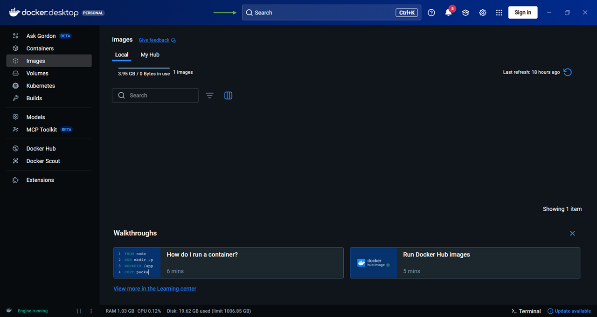
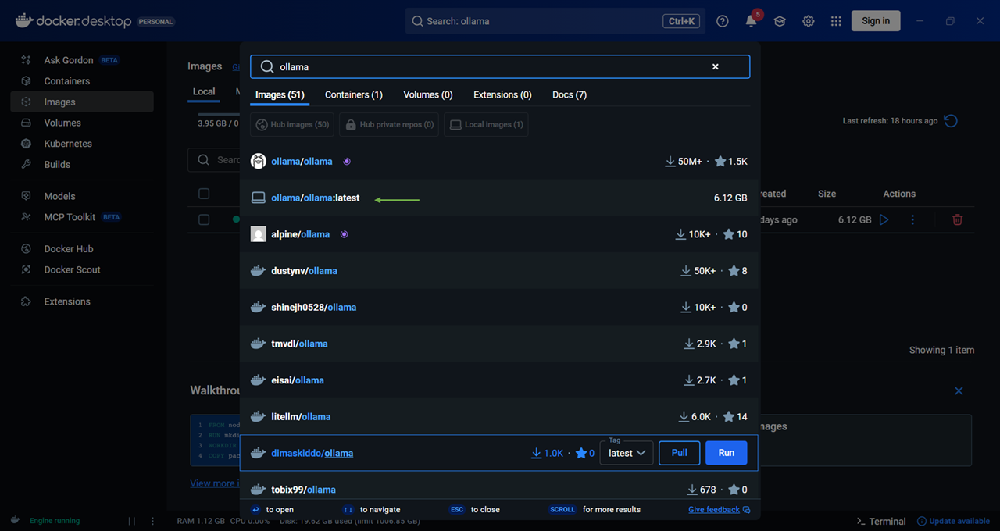
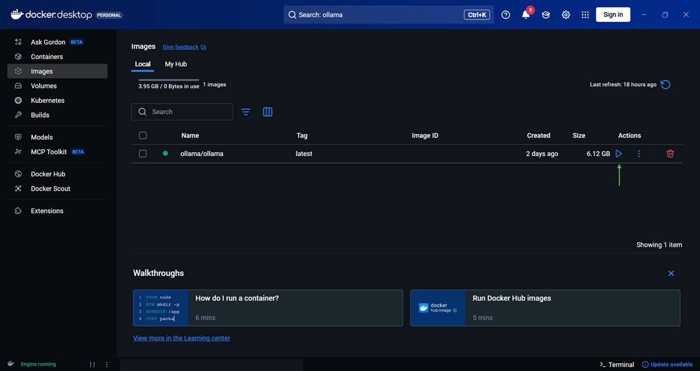
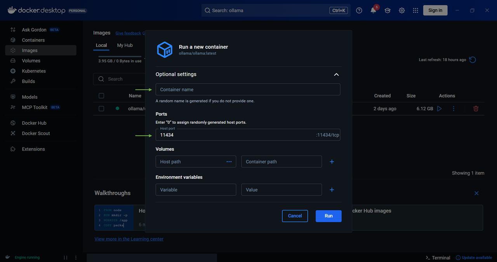

# Web Rag Scraper

<div align="justify">
This project focuses on building a Web-based Retrieval-Augmented Generation (RAG) application that combines real-time web data with large language models to generate accurate and context-aware responses. The system retrieves relevant information from online sources, processes and ranks the content using semantic embeddings, and generates grounded answers using a local language model. Designed with a modular and scalable architecture, the application ensures reliable information retrieval while maintaining clear separation between data collection, processing, and response generation.
<br><br>
</div>


## Setup
<h3>
<div>
 <b>Environment</b>
</div>
</h3>

*Note - The app is written using Python virtual environment version **3.12.10** and supports the latest Python versions. However, lower Python versions may offer more stability compared to the latest ones. Below setup will focus Windows system. And commands to setup may vary for macOS or Linux.*

<div>
1. Move to folder (CLI commands)

```bash
# If you downloaded the file, just navigate to folder
# Then press Shift (in Windows) + Right Mouse click
# Choose Open PowerShell window here option and move on to creating virtual environment
cd web_rag_scraper
```
</div>

<div>
2. Create a python virtual environment using -

```bash
# Path to installation of particular version of python  may vary
# I have installed more than one version of python in pyver directory
# Refer the resources section, for youtube video to install multiple versions of python
C:\Users\<username>\pyver\py3121\python -m venv ragenv
```
</div>

<div>
3. Activate the virtual environment using -

```bash
ragenv\Scripts\activate
```
</div>

<div>
4. Install python packages using - 

```bash
pip install -r requirements.txt
```
</div>

<div>
<h3>
 <b>Docker and WSL</b>
</h3>
</div>

<div>
1. Activate <i>Virtual Machine Platform</i> and <i>Windows Subsystem for Linux</i> feature by searching for <i>Windows Features on or off</i>.  
</div><br>

<div>
2. Above step is applicable only for Windows PC to activate WSL. Since, Docker requires Linux environment to run containers, we'll also need to install a Linux distribution along side the WSL.
</div><br>

<div>
3. I chose Ubuntu Linux Distribution from Microsoft Store. You can choose any distro for this application.
</div><br>

<div>
4. After Linux distribution is installed, get the <i>Docker Desktop (It depends on the OS, and the architecture) application</i> to locally run the LLM model.
</div><br>

<div>
5. Note - For docker desktop installation, choose the default settings and continue with the installation steps.
</div><br>

<div>
6. Now let's get the Ollama LLM model to generate answers.
</div><br>

<div>
7. Open docker desktop and click on search bar.
</div><br>

<div>
8. Search for <b>ollama/ollama:latest</b>. Since, I had already installed the model, it does not shows download icon on the right-hand side of the image. 
</div><br>

<div>
9. After pulling/downloading the <i>ollama</i> image, click the play button to create a new container.  
</div><br>

<div>
10. Give a name to the container. And by default the ollama runs at 11434 tcp port. Choose the run button to start the container. 
</div><br>

<div>
11. Congratulations! You have completed the setup to create a simple container to containerize an application.
</div>

<div>
<h3>
 <b>Ollama and Gemma3</b>
</h3>
</div>

<div>
1. We'll use ollama in docker to get models with particular specifications or size of model. In ollama we'll install a model from Unsloth available on huggingface. So, please install it on your pc from this <a href="https://huggingface.co/unsloth/gemma-3n-E4B-it-GGUF/resolve/main/gemma-3n-E4B-it-Q4_K_M.gguf">link</a>.
</div><br>

<div>
2. After installation is complete, move the downloaded file to the <a href="models">models</a> folder.
</div><br>

<div>
3. Now change the current working directory in terminal to `models`, using below command.

```bash
cd models
```
</div>

<div>
4. After the directory points to <i>models</i>, make sure it has the file extension of <i>.gguf</i>.
</div><br>

<div>
5. Copy the gemma model to the docker ollama container. <i>Note - Please enter the name of container that you had created with for ollama image.</i>

```bash
docker cp gemma-3n-E4B-it-Q4_K_M.gguf your_container_name:/root/.ollama/models/
```
</div>

<div>
6. Copy the Modelfile for running the model in ollama container -

```bash
docker cp Modelfile your_container_name:/root/.ollama/models
```
</div>

<div>
7. Open docker container's terminal within the opened terminal. <i>Note - Make sure the ollama's docker container is running to execute below command</i>

```bash
docker exec -it your_container_name bash
```
</div>

<div>
8. Load the model file details with naming alias as gemma-3n using below command. 

```bash
ollama create gemma-3n -f /root/.ollama/models/Modelfile
```
</div>

<div>
9. Congratulations! You have successfully completed the setup of Local LLM model by containerizing it in the Docker.
</div><br>

<div>
10. (Optional) You can experiment it with other local modals as well under Ollama models list. In below, check which commands to use to access them.

```bash
## No file download is needed for getting the model
## The model can be directly pulled from Ollama's model list
## Don't use this command
docker cp gemma-3n-E4B-it-Q4_K_M.gguf your_container_name:/root/.ollama/models/

## Don't use this command 
docker cp Modelfile your_container_name:/root/.ollama/models

## Start from here
## Enter the docker container's bash
docker exec -it your_container_name bash

## Pull the model of your choice
ollama pull mistral

## Change the model name in config.py to "mistral" and chekout the results!
```
</div>

## Execute
This section explains how to run the application, the folder structure involved, and the different features available once the app is running.

**Project Overview**
<ul>
<li>

`models` folder contains LLM model and Modelfile for the web scraper.
</li>
</ul>

<ul>
<li>


`main.py` The main entry point of the application. Running this file initializes the web scraper, content parser, text processor and text generator.
</li>
</ul>

<ul>
<li>

`logger` folder keeps track of steps that execute on the interface or application.
</li>
</ul>

**Steps to run**

<div>
1. Run the app using below command (before running please activate the virtual environment)

``` bash
python main.py
``` 
</div>

<div>
2. Enter your query to search from web
</div><br>

**Features**
<ul>
<li>

*Citations* - Provides link to sources searched.
</li>
</ul>

<ul>
<li>

*Best sources* - Ranks or selects top websites which matches user intent.
</li>
</ul>

<ul>
<li>

*LLM text generation* - Uses pretrained LLM model for providing context-aware information.
</li>
</ul>

<ul>
<li>

*Docker containers* - Uses protected environment i.e. containers, to virtually or privately access information.
</li>
</ul>

<ul>
<li>

*Compatible to open source* - Can use open-source LLM models to generate text.
</li>
</ul>

## Collaborator

<i>Special thanks to <a href="https://github.com/Vital-98">Vital-98</a> for helping create this project.</i>


## Resources
**Python Version Setup**
<ul>
<li>https://www.youtube.com/watch?v=28eLP22SMTA&t=99s</li>
</ul>

**WSL and Linux**
<ul>
<li>https://learn.microsoft.com/en-us/windows/wsl/install</li>
<li>(Ubuntu - Microsoft Store) https://apps.microsoft.com/detail/9pdxgncfsczv</li>
</ul>

**Docker Documentation**
<ul>
<li>https://docs.docker.com/desktop/</li>
<li>https://docs.docker.com/get-started/introduction/</li>
</ul>


**Huggingface Hub**
<ul>
<li>(Our model <i>gemma-3n-E4B-it-GGUF:Q4_K_M</i>) https://huggingface.co/unsloth/gemma-3n-E4B-it-GGUF/tree/main</li>
</ul>
